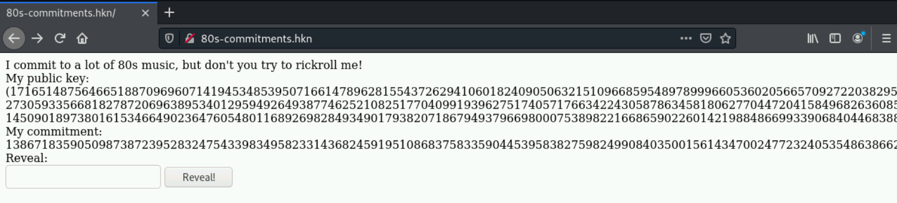

# 80s-commitment

We're presented with a website, the python running behind it, and are asked to rickroll the author:



The most important things to realize here, is that the video identifiers are converted to integers and are then encrypted using ElGamal.

## ElGamal

ElGamal is a very interesting encryption method, in that it's homomorphic, meaning we can actually perform basic arithmetic on encrypted values. Which means in essence doing these two things would result in the same ciphertext: `enc(a)*enc(b) = enc(a+b)`. Note this is a simplication, we'll look at an actual formula in a second.

In ElGamal you encrypt by lifting some generator *g* to the power of your message and multiplying it with your public key modulo some large prime:    
Because of the associative property of multiplication this also means that if we had some other message  that we wanted to add to the encrypted message, we can do just that by multiplying it with *c* since . Ofcourse if we wanted to subtract we could also do that, using the multiplicative inverse of the value we wanted to subtract.

## The Solution

Since we can manipulate the encrypted data and know what it decrypts to, we can exploit the encryption itself, by just adding or subtracting from the actual message to achieve some other value when it's decrypted.

First let's find out what video id is currently linked on the website, we just paste the commitment on the website into the box and we get `YZUE4_PtOk0`. We also know from the python code that the ID we're supposed to end up with is `dQw4w9WgXcQ`.  
We can decode those to integers to get the values below.  
commit video: 7031531770305395277  
rickroll video: 8434178615911931332

This is great, since the rickroll video is a larget number, we can essentially just "add" the difference between the two to the encrypted message.  
We can easily find the difference: 8434178615911931332 - 7031531770305395277 = 1402646845606536055.  
The commit_id function essentially just converts from base64 to an integer and then lifts the generator to the power of whatever integer the id converts to, so it forms g<sup>m</sup>. We can do the same thing with our diff:  
`add_value = pow(key.g, 1402646845606536055, byteorder = 'big'), key.p)`  
All we need to do now is multiply the commitment on the website with this value modulo key.p, like the example in the ElGamal section, and we get our result:
114153471363479074732741039105221960382301474843192036667761822778390046362949147937010974352187924051138566688709481919076595890377917675589997277019951752217826288423674009060504483355327192007673834082989961616355740202775368749278232108690251816954353796675061222245233772155706998962416024925109459167366

After inputting this on the website we get the flag: DDC{4ldr1g_g1v3r_j3g_d1g_0p_3ll3r_n0g3T}

## Script solution

Putting all of the above into a little script that just needs the video id and old commitment value to work:

```python
import base64
from Crypto.PublicKey import ElGamal

# Dynamic from site
commitment = 138671835905098738723952832475433983495823314368245919510868375833590445395838275982499084035001561434700247723240535486386627096186739675025575325338218250692521623125155016559582028125766471170302314028958855796588183851461828229754843181952957852839698704015843548770193770126453610555328208796886608695123

keytuple = (171651487564665188709696071419453485395071661478962815543726294106018240905063215109668595489789996605360205665709272203829586629878234979355953282462961745069389037545035054232207660340222173839586890685127419728129664935083084059915287590870642102026331366475529208457259452436612905460819402026975569601899, 27305933566818278720696389534012959492649387746252108251770409919396275174057176634224305878634581806277044720415849682636085818092615674889056390082015679654921658340400858196943671854522774982673668016420578497559718448965162949499550758735528210054243289575125149360586547518514288700022584365578504751595, 14509018973801615346649023647605480116892698284934901793820718679493796698000753898221668659022601421988486699339068404468388106933045944721080609239218644336378600784755810851494467805584561029049044869164340724415833814070220331196859578505004220345685572994813155151967295398442102145775813982857405944710)

key = ElGamal.construct(keytuple)

rickrollid = 'dQw4w9WgXcQ'
web_id = 'YZUE4_PtOk0' #Dynamic from site

rickroll_int = int.from_bytes(base64.urlsafe_b64decode(rickrollid+'='), byteorder = 'big') 
web_int = int.from_bytes(base64.urlsafe_b64decode(web_id+'='), byteorder = 'big')


diff = rickroll_int - web_int
diff_commit = pow(key.g, diff, key.p)

new_commit = (commitment * diff_commit) % key.p

print(new_commit)
```
